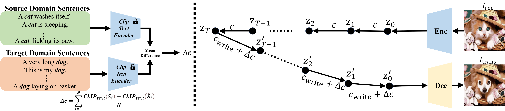
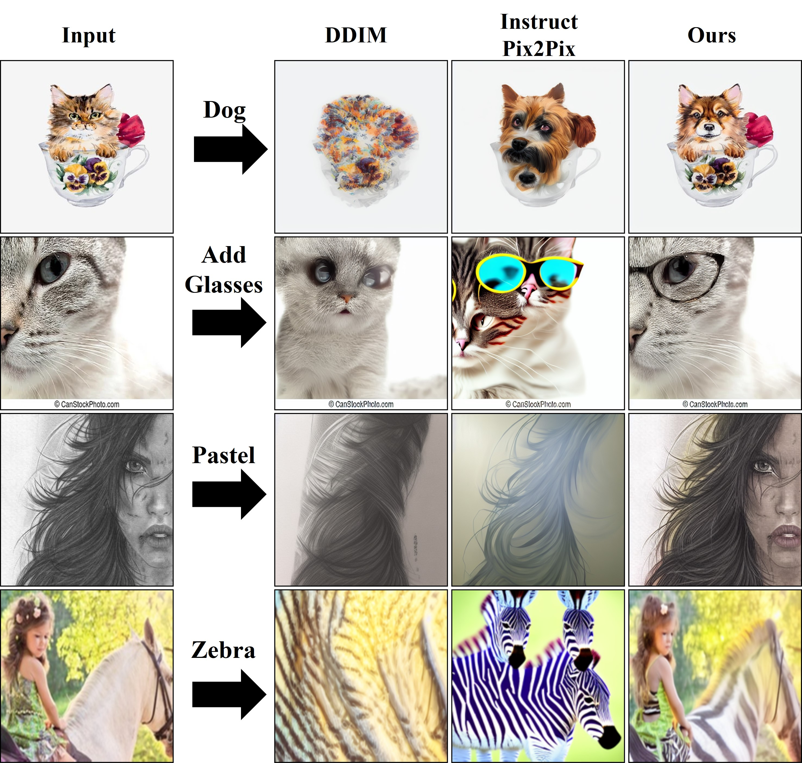

# MirrorDiffusion

[[Project Homepage]](https://mirrordiffusion.github.io/)  [paper]


## Method



## Getting Started

**Environment Setup**

- We provide a [conda env file](environment.yml) that contains all the required dependencies
  ```
  conda env create -f environment.yml
  ```
- Following this, you can activate the conda environment with the command below. 
  ```
  conda activate mirrordiffusion
  ```

**Download Dataset**

- C2D-F and C2G-F: <a href='https://drive.google.com/file/d/1q9PEfJYxYWhOdJloto0QuUg-bLUICh3_/view?usp=share_link'>[Google Drive]</a>.
- H2Z-F:  <a href='https://drive.google.com/file/d/1iw440bF-G0NZjOTrew1KjbS-SYkE1Wce/view?usp=share_link'>[Google Drive]</a>.
- S2O-F: <a href='https://drive.google.com/file/d/1LbAvRr1CvTu1GLXuk0Y2chYEsq0E3IQs/view?usp=share_link'>[Google Drive]</a>.

**Real Image Translation**

- First, run the inversion command below to obtain the input noise that reconstructs the image. 
    ```bash
    python src/null_inversion.py   --input_image ./assets/test_images/cat/  --results_folder ./exp_output/stable_cat/ --num_ddim_steps 60
    ```
- Next, we can perform image editing with the editing direction as shown below.
    ```bash
    python src/null_edit.py     --inversion "test/stable_cat/null_inversion/"     --prompt "test/stable_cat/prompt/"     --task_name "cat2dog" --results_folder ./exp_output/sketch_cat/  --num_ddim_steps 60
    ```

**Finding Custom Edit Directions**<br>

```
   python generate_direction.py
```

## Comparison



## Acknowledgement

This project is build based on [Pix2Pix-Zero](https://github.com/pix2pixzero/pix2pix-zero) and [Null-Text Inversion](https://github.com/google/prompt-to-prompt/#null-text-inversion-for-editing-real-images). We thank the authors for sharing their code.
