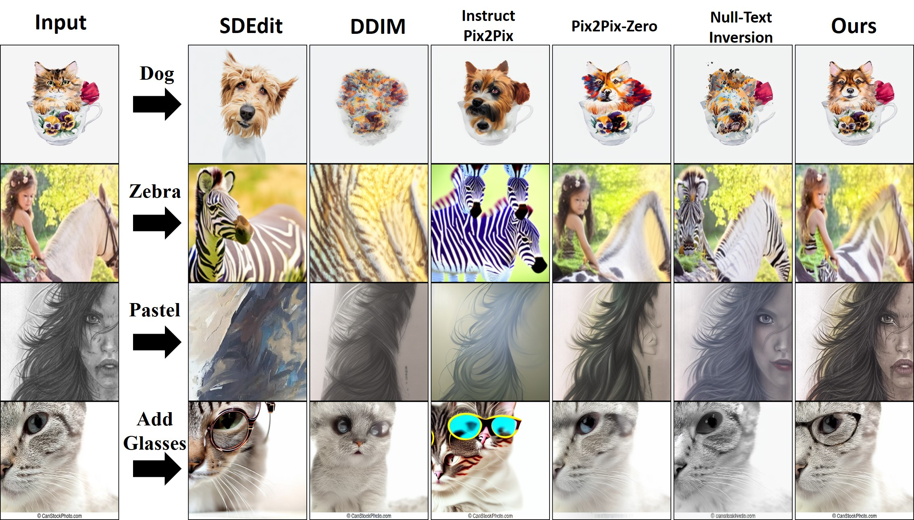

# MirrorDiffusion


## Getting Started

**Environment Setup**
- We provide a [conda env file](environment.yml) that contains all the required dependencies
  ```
  conda env create -f environment.yml
  ```
- Following this, you can activate the conda environment with the command below. 
  ```
  conda activate mirror_diffusion
  ```

**Real Image Translation**

- First, run the inversion command below to obtain the input noise that reconstructs the image. 
    ```bash
    python src/null_inversion.py   --input_image ./assets/test_images/cat/  --results_folder ./exp_output/stable_cat/ --num_ddim_steps 60
    ```
- Next, we can perform image editing with the editing direction as shown below.
    ```bash
    python src/null_edit.py     --inversion "test/stable_cat/null_inversion/"     --prompt "test/stable_cat/prompt/"     --task_name "cat2dog" --results_folder ./exp_output/sketch_cat/  --num_ddim_steps 60
    ```

**Finding Custom Edit Directions**<br>

```
   python generate_direction.py
```

## Comparison


